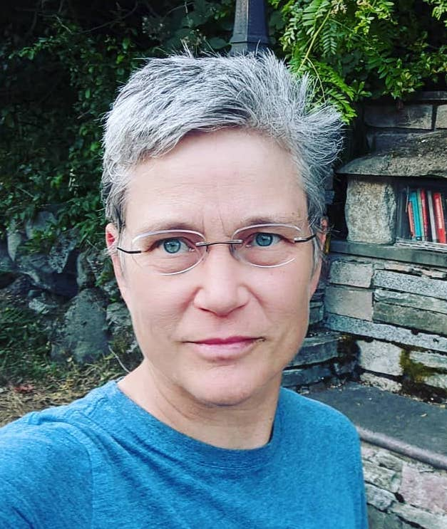

```{r setup, include=FALSE}
knitr::opts_chunk$set(echo = TRUE)
```



I am a modeler/applied mathematician at the Nortwest Fisheries Science Center (NOAA Fisheries). I develop R packages for public use and teach workshops and classes on statistics, R and reproducible research. Much of my work along these lines is on my [GitHub profile](https://github.com/eeholmes) and [website](http://eeholmes.github.io/).

Training material that I have written can be found at

* [RWorkflow Workshops](https://rverse-tutorials.github.io/RVerse-Tutorials/)
* [NMFS R User Group Sessions](https://nmfs-openscapes.github.io/Training/)
* [Applied Time Series Analysis](https://atsa-es.github.io/)

I am also immersed in the Open Science community. I am also a contributor to [Openscapes](https://github.com/openscapes), [NMFS Openscapes](https://github.com/nmfs-openscapes) and [R-Govys](https://github.com/rgovys), which are working to support adoption of open science and open source workflow in government.


