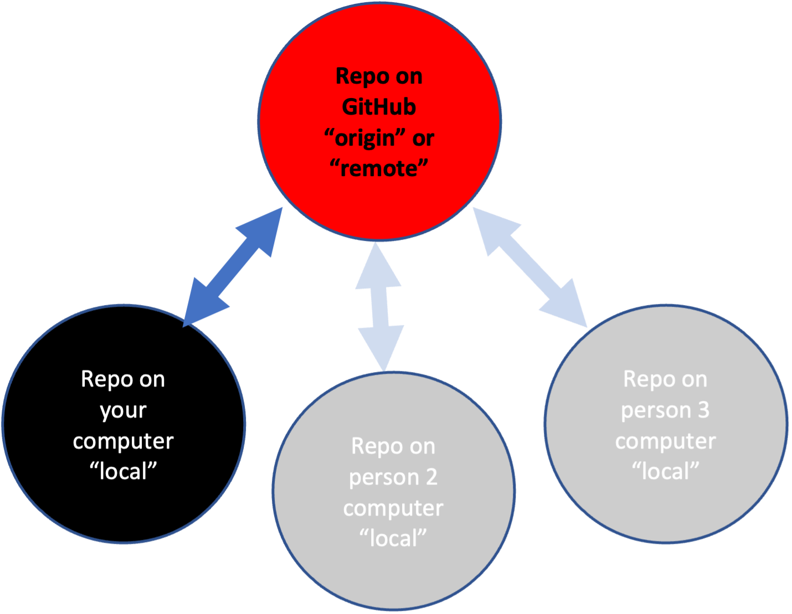

```{r setup, include=FALSE}
knitr::opts_chunk$set(echo = TRUE)
set.seed(1234)
```

```{r echo=FALSE, message=FALSE, warning=FALSE}
library(kableExtra)
dt <- data.frame("Compartmentalized", "Documented", "Extendible", "Reproducible", "Robust")
kable(dt, col.names=NULL) %>%
  kable_styling(full_width = TRUE) %>%
  row_spec(1, bold = FALSE, color = "white", background = "blue") %>%
  column_spec(column = 1:5, width = "20%")
```

# What is Git and GitHub?

**Git** A program to track your file changes and create a history of those changes. Creates a 'container' for a set of files called a repository.

**GitHub** A website to host these repositories and allow you to sync local copies (on your computer) to the website. *Lots* of functionality built on top of this.

## Some basic Git jargon

* Repo: Repository. It is your code and the record of your changes. In a hidden folder called `.git` (so if you wanted to get rid of the history and other Git info, you could delete that folder). You have a local repo and a remote repo (on GitHub/GitLab).
* Actions: Commit, Push, Pull
* Git: The program that keeps track of the changes on local and remote("origin") repo.
* Git GUIs: A graphical interface for Git (which is command line). There are [many](https://git-scm.com/downloads/guis). I am teaching an easy-entry one, [GitHub Desktop](https://desktop.github.com/).


# Overview

Today I will cover the basic Git/GitHub skills (and info) that are all most people need for 95% of their work. I am using [GitHub Desktop](https://desktop.github.com/). If you want to use Git from RStudio, [go to set-up](set-up.html) and scroll to the section on RStudio and Git.

Simple Workflow:

* Make local (on your computer) changes to code.
* Record what those changes were about and commit to the code change record (history).
* Push those changes to your remote repository (aka origin)

We'll do this


Not this, i.e. what you would see if you Google "Git".

{width=400px}

# The 3 Skills

Repository skills (using GitHub Desktop)

* Skill 1: Create a blank repo on GitHub
* Skill 2: Clone one of your **GitHub** repos onto your computer
* Skill 0: Open your repository in your editing platform. I am going to use RStudio, but you use whatever you edit in.
* Skill 3: Commit local changes and push GitHub

* Skill 1b: How to clone someone else's GitHub repository

{width=200px}

## Skill 1: Create a blank repo on GitHub

1. Click the + in the upper left from YOUR GitHub page.
2. Click new and add the Readme file and .gitignore

## Skill 2: Clone your repo to your computer

1. Copy the URL of your repo. `https://www.github.com/yourname/yourrepo`
2. Open GitHub Desktop on your computer. Click File > Clone Repository
3. Click URL in the box that pops up and paste in the URL above
4. Double check that you are saving the repo in the right place

## Skill 0: Make project in RStudio

1. Open RStudio and click the project tab in the top right and select, `New Project`. 
2. Select `Existing Directory` and navigate to the directory where you 
just saved the repo.
3. Click 'Create project'

## Skill 3: Commit and push changes

1. Make some changes to a file or add a file.
2. Open GitHub Desktop, click the little checkboxes next to the changes.
3. Add a commit comment, commit.
4. Click Push at top to push the changes to GitHub

## Skill 1b: Copy a repo on GitHub

You can clone your own or other people's repos.

1. In a browser, go to the GitHub repository you want to copy.
2. Copy its url.
3. Navigate to your GitHub page: click your icon in the upper right and then 'your repositories'
4. Click the `+` in top right and click `import repository`. Paste in the url and give your repo a name.
5. Use Skill #1 to clone your new repo to your computer


## Skill 1c. Use an existing repository as a template for something new

Let say you want to make a copy of one of your GitHub repositories and use it as a template to make something brand new.

1. Clone the repository that you will be building off of to GitHub
2. Use skill #1 to pull that repository onto your computer
3. Get rid of any files you don't want in the new repo and use skill #3 to push those to GitHub.

# Other useful but not critical skills

## Pull changes on GitHub

1. Make some changes directly on GitHub
2. Click Pull in GitHub Desktop

## Make an existing folder on your computer a GitHub repository

1. Use skill #1 to create a blank repo on GitHub and clone onto your computer
2. Copy the files you want to your new repository folder
3. Use skill #3 to push those to GitHub

Note there are some easier ways to do this but the above is how to do it with your skills 1-3.


# Definitions

## Forking versus Cloning

Forking is if you are contributing to someone else's repository. In that case, you need to make 'pull requests'. Pull request = 'here is a suggested change' request.

Cloning is if you want your own copy of the repository because you want to make your own version of the code or use it as a starting point for your own project. Or you need to clone a blank repository to get started on a project.

## Merge conflicts

Merge conflicts happen when there are changes to a file on your remote repository (GitHub) but also changes to that same file on your local repository. Git doesn't know how to resolve the conflicting changes and needs your help. GitHub Desktop will warn you and give you some helpful options to resolve these.

## Branches

A copy of your repository that you can work on without changing the main repository. Once you are done, you incorporate the changes into the main repository. **Most of you should steer clear of branches** because they are incompatible with our common workflows!! I maintain many repositories and use branches on only 2 of them.


# Review: A workflow to minimize headaches

* Open GitHub Desktop
* Do a pull from GitHub
* Work
* Commit changes and push up

### Starting out

* Don't use branches when you are just starting. You might never need them.
* Skills 1-3 are most of what anyone needs.
* Get in the habit of always doing a Pull/Push before you start work in your project.

FAQ

* Fork or clone? Which should I use?