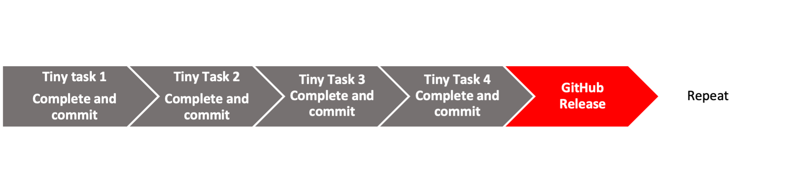
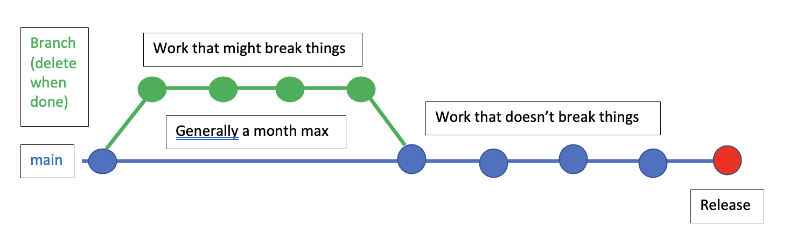

```{r setup, include=FALSE}
knitr::opts_chunk$set(echo = TRUE)
set.seed(1234)
```

```{r echo=FALSE, message=FALSE, warning=FALSE}
library(kableExtra)
dt <- data.frame("Compartmentalized", "Documented", "Extendible", "Reproducible", "Robust")
kable(dt, col.names=NULL) %>%
  kable_styling(full_width = TRUE) %>%
  row_spec(1, bold = FALSE, color = "white", background = "blue") %>%
  column_spec(column = 1:5, width = "20%")
```


# Overview

Key GitHub.com skills.

* How to use issues.
* How to use releases.
* A production workflow (what I do).
* How to use organizations---for yourself or a team.
* How to set things up in your shared repository in order to work as a small team.

# Key GitHub skills

## Issues

* Use the Issues in GitHub to enter any issues (bugs, feature changes, notes).


* Add code to your issue so you can easily recreate the problem.


* You can reference issues in your commits with #<num of the issue>

## Releases

* The release or tag feature in GitHub will help you go back in time and document working states
* Use a NEWS file to keep a notebook of all your major changes.

*Pro tip* checkout the state of the repository at the time of a release. From the terminal:
```
git checkout v1.0
```
When done:
```
git switch -
```

**Warning `git checkout ...` will change all your time stamps.**

## My production workflows

[MARSS R package](https://atsa-es.github.io/MARSS/)

I develop on the main branch as long as I can break work into small tasks. The versions that users use are either CRAN releases or GitHub releases. I warn them that the main branch is a development branch and might be broken.

### Workflow with small tasks




### Workflow when I might break things

A major re-organization or new functionality that has the potential to break things is done on a branch.




## Organizations

I use this to organize collections of repositories. Example: https://github.com/eeholmes

* Share access to repos across a team
* Have team discussions
* Have a organization landing page


## Pro tip: Using GitHub Actions

* [Eli's NMFS R UG presentation on GitHub Actions](https://github.com/nmfs-openscapes/12-07-21-GitHub-Actions) 

You may have heard about them. Let's see it in action. We make a GitHub Action that will update our Readme file whenever a relevant change happens. We'll see a bigger example next week with RMarkdown reports.

To set up our action:

* Create a .github folder in our repo
* Create a workflows folder in the .github folder
* Create a file `render-readme.yml` with the instructions for what to do to make the Readme.md file.

Our yml file has a set of instructions to the server that is going to do the work.

```
on:
  push:
    paths:
      - README.Rmd
      - test.csv

name: Render README

jobs:
  render:
    name: Render README
    runs-on: macOS-latest
    steps:
      - uses: actions/checkout@v2
      - uses: r-lib/actions/setup-r@v1
      - uses: r-lib/actions/setup-pandoc@v1
      - name: Install packages
        run: Rscript -e 'install.packages(c("rmarkdown", "knitr"))'
      - name: Render README
        run: Rscript -e 'rmarkdown::render("README.Rmd", output_format = "md_document")'
      - name: Commit results
        run: |
          git commit README.md -m 'Re-build README.Rmd' || echo "No changes to commit"
          git push origin || echo "No changes to commit"
```


