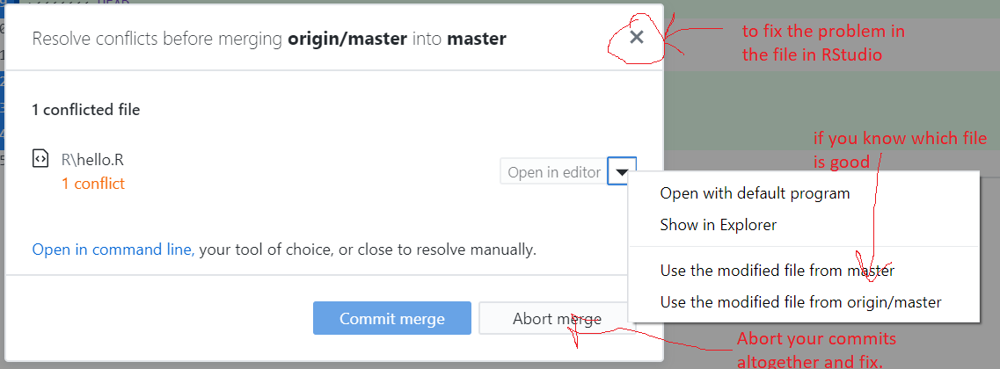

```{r setup, include=FALSE}
knitr::opts_chunk$set(echo = TRUE)
set.seed(1234)
```

```{r echo=FALSE, message=FALSE, warning=FALSE}
library(kableExtra)
dt <- data.frame("Compartmentalized", "Documented", "Extendible", "Reproducible", "Robust")
kable(dt, col.names=NULL) %>%
  kable_styling(full_width = TRUE) %>%
  row_spec(1, bold = FALSE, color = "white", background = "blue") %>%
  column_spec(column = 1:5, width = "20%")
```


# More Git skills

## The `.git` folder

The `.git` folder is what has the repository information and tells Git that this is a Git repository. If you want your folder to stop being a Git repository, delete this. Looking at the `config` file can often help you solve problems with connecting to a remote repository.

## The `.gitignore` file

Add files (or folders) here so that they are ignored.

## Getting rid of changes you have made

Say you made a change and you need to get rid of that. The temptation (for me) is to jump onto the Git command line and clobber my repository with `reset` and `revert` commands. **Don't do this.** Here are some strategies that are less prone to leaving your code a mess.

### Have you commited the changes yet?

**No?** Easy click on the file in GitHub Desktop, right click and click 'Discard Changes...'. Note this will take things all the way back to your last commit!! If you have been making a bunch of changes without committing those, then you are out of luck.

**Yes?** Go to History in the GitHub Desktop window, click on the commit and click 'Revert'. This will get rid of all the changes that went with that commit. So if you changed multiple files, all those files will be reverted. If you have pushed the changes to GitHub, then you can push the revert and it'll show up on GitHub too.

## Recovering a single file

Let's say you made a big multi-file commit and you want to revert one file.

You can do this at the Git command line, but I find that to be a huge time suck and in my early Git days, I sometimes left my repository with a horrible problem that I could not fix and had to completely rebuild my repo. Since I don't need to be a Git wizard, this is what I do when I want to go 'back in time' for a single file.

Assuming you have already pushed the changes up to GitHub

* Go to the repo on GitHub
* Click 'commits' It's a little icon above your code with a clock with a counter-clockwise arrow.
* Scroll to the commit where the file was in the state you want (one before the last bad commit).
* On the right click the `< >` to browse your repo at the state in time where your file was ok.
* Click on the file and copy the text.
* Go back to RStudio, open the file, and paste in the text from when it was good.

If you have not pushed the changes up to GitHub.

* Now you have to go to the Git command line. Git tab in RStudio and then click the cog > Shell.
* Note, in 9 times out of 10, I would push the commit to GitHub and then use the above copy/paste to avoid using the Git command line. I would find that much faster.

Ok, here's the Git command to get a single file back. This works whether or not you have pushed to GitHub. The problem with this and why I don't do it is that I usually need to look at the file. So I am scrolling back through the status of my repo in the past until I find the status that I want. Then I stare a bit and think and think. Then get a coffee and think some more. Then I scroll back through the status of the repo in the past some more and THEN I do the copy and paste. It is rarely the case that I know exactly what commit that I need to get rid of---and even rarer that I want to go completely to a status in the past.

* Open the Git bash shell
* `git log` to find the commit hash (the long number)
* `git checkout 1d0f8c2eb4e66db0a7123588ae2fad26a6338303~1 -- ./R/test.R`  would reset test.R to one before that commit. This part `1d0f8c2eb4e66db0a7123588ae2fad26a6338303` is the bad commit hash and this part `~1` means what the file was like 1 commit before that.
    
If you accidentally leave off the file name and Git says you have a detached head, use `git checkout master` to reattach your head.

## Resolving merge conflicts with GitHub Desktop

GitHub Desktop makes resolving these pretty easy.

1. If it tells you to fetch commits off GitHub, go ahead and do that.
2. Now try to Pull. It'll tell you that you have conflicts and give you options for what to do.



* Click the 'x' and Git will alter `hello.R` and show where the conflicts are. You then edit `hello.R` in RStudio to fix the conflicts.
* If you know what file you want to use, use the little arrow dropdown to use the file on GitHub or on your local machine.
* Use Abort Merge to abandon the merge. Your changes to `hello.R` are still there.
    * Click on History, right click the commit and revert to get rid of it. All file changes that are part of that commit will disappear! You can revert the revert if needed.
    * Go into `hello.R` and fix the conflict. Git won't have marked it so it might be hard to find.
    
**Those using Git in RStudio** Merge conflicts are a bit of a disaster in RStudio, and RStudio gives no warning before it mucks up your files. So it you are pushing/pulling from RStudio be sure to practice on some toy merge conflicts before you run into a real one.

## Generating Personal Access Tokens

If you use a non-GitHub interface (like RStudio, GitLab, jupyter-git, etc), you need to access GitHub using a Personal Access Token not your user password.

When you are asked for you username and password. **You do not enter your password!**
    * Go to GitHub.com
    * [Follow instructions for generating a Personal Access Token](https://docs.github.com/en/authentication/keeping-your-account-and-data-secure/creating-a-personal-access-token) **Make sure to click the "repo" checkbox for scope*.
    * Copy the token and use that for your password.


## Pro tip: I want time-stamps back!

*Time stamps* is something that you probably use to see when a file was last changed. Time stamps lose meaning if you use `git checkout` for branches or tags. In fact, in the Git-verse, time doesn't exist since Git workflow is not necessarily linear. I find this very confusing so I purposely work in a linear fashion with Git.

To fix time stamps when you use `git checkout` (i.e. switch branches), you can use a `post-checkout` file in the `.git/hooks` folder.

1. Open `post-checkout.sample`. Save as `post-checkout`
2. Copy this into that file

```
#!/bin/sh -e

OS=${OS:-`uname`}

if [ "$OS" = 'Darwin' ]; then
  get_touch_time() {
    date -r ${unixtime} '+%Y%m%d%H%M.%S'
  }
else
  get_touch_time() {
    date -d @${unixtime} '+%Y%m%d%H%M.%S'
  }
fi

# all git files
git ls-tree -r --name-only HEAD > .git_ls-tree_r_name-only_HEAD

# modified git files
git diff --name-only > .git_diff_name-only

# only restore files not modified
comm -2 -3 .git_ls-tree_r_name-only_HEAD .git_diff_name-only | while read filename; do
  unixtime=$(git log -1 --format="%at" -- "${filename}")
  touchtime=$(get_touch_time)
  # echo ${touchtime} "${filename}"
  touch -t ${touchtime} "${filename}"
done

rm .git_ls-tree_r_name-only_HEAD .git_diff_name-only
```

# Topics I didn't cover:

* Working with Git from the **command line**. For most of you, you have no need for this and this is just a good way to mess up your repository. The exception is a few unique cases where you do need to issue a Git command (like `git push` first time you need to give RStudio your GitHub login).

* How to do a **pull requests**. I'll post a video. Most of you won't need this.

* **Branches** You won't need branches when starting, in fact I rarely use them and I have over 100 repositories. I only use branches in a public R package that I maintain.


