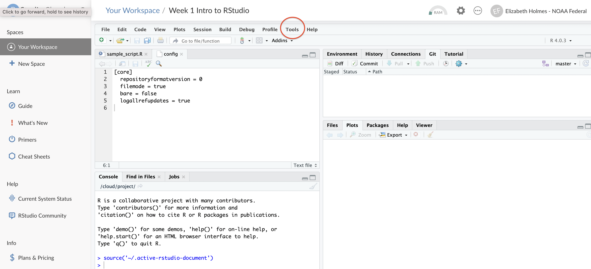
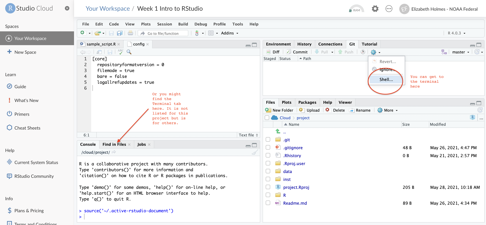

```{r setup, include=FALSE}
knitr::opts_chunk$set(echo = TRUE)
```

```{r echo=FALSE, message=FALSE, warning=FALSE}
library(kableExtra)
dt <- data.frame("Compartmentalized", "Documented", "Extendible", "Reproducible", "Robust")
kable(dt, col.names=NULL) %>%
  kable_styling(full_width = TRUE) %>%
  row_spec(1, bold = FALSE, color = "white", background = "blue") %>%
  column_spec(column = 1:5, width = "20%")
```

# Set-up

There is no set-up. Just log into RStudio Cloud with a Google email.

# Overview

*What is RStudio Cloud?* RStudio in a website. Works just like RStudio on your computer in most ways. Free for not too intensive stuff. Note RStudio Cloud projects can be launched in RStudio platform or Jupyter! This is not R specific.

*Why use RStudio Cloud?*

* **Individuals** You don't have RStudio installed or you want to try a workspace (file, packages, etc) that someone else has prepared in order to try out code.

* **Instructors** Teach without students having to install anything. Customize the workspace the way you want it.

Also easy entry to cloud computing, which is the way the field of code development is moving.

*Schedule*

3-3:50pm (Eastern): RStudio Cloud for individuals. I'll give you a tour of the basic features.

4-5pm (Eastern): RStudio Cloud for instructors. I'l show you how to set-up a space for students and how to share that space in two different ways.

# RStudio Orientation

When you open RStudio you will see 4 panels:


# RStudio Cloud Basics

https://rstudio.cloud

* Logging in
* Creating a project
* Installing packages
* Running scripts
* [Running R Markdown](https://rstudio.cloud/project/2649365)
* [Linking to GitHub](set-up.html#Git_in_RStudio_Cloud)

## Create an RStudio Cloud Project

1. Click the blue button on upper right
1. Choose New RStudio Project
1. Install your needed packages

### Add a new script file

1. Add a new file using 'File > New File > R Script'
2. Or you can click the new icon in top left corner.
2. Add some code to that file. Copy and paste in:

```
require(graphics)
## Annette Dobson (1990) "An Introduction to Generalized Linear Models".
## Page 9: Plant Weight Data.
ctl <- c(4.17,5.58,5.18,6.11,4.50,4.61,5.17,4.53,5.33,5.14)
trt <- c(4.81,4.17,4.41,3.59,5.87,3.83,6.03,4.89,4.32,4.69)
group <- gl(2, 10, 20, labels = c("Ctl","Trt"))
weight <- c(ctl, trt)
lm.D9 <- lm(weight ~ group)
opar <- par(mfrow = c(2,2), oma = c(0, 0, 1.1, 0))
plot(lm.D9, las = 1)      # Residuals, Fitted, ...
par(opar)
```

### Run the code

1. Select all the lines of code and select 'Run'
2. Run all the code by selecting 'Source'

## Let's run RMarkdown

Click this: https://rstudio.cloud/project/2649365

It all just works (after installing the knitr and rmarkdown packages)!

## Share your project

1. Copy the URL (in browser). 
1. Email that.
1. The person will be able to open a temporary copy or save if they want to keep their changes.

## Helpful tips

* Edit > Find in Files...
* Code > Comment
* File > New (templates)
* History tab
* Help tab (index at bottom)
* Help > Markdown quick reference

## Create a project from a GitHub repo

1. Click the blue New Project button
2. Copy the GitHub URL for a repo in

For example, https://github.com/RVerse-Tutorials/Test

3. Regardless of whether I can push to this repo, I can pull changes in from GitHub.

## Set up to be able to push to GitHub from RStudio Cloud

1. Tell RStudio Cloud you want use Git. Open your project then Click Tools > Global Options > Git/SVN (left nav) and check 'Enable version control for RStudio projects'
{25%}

2. Click the Terminal tab in the lower left panel or click the blue cog below the Git tab in the upper right panel.
{25%}

3. Type in this with your info
```
git config --global user.email "<your email>"

git config --global user.name "<your name>"
```

4. Make a change to a file and commit the change. * Click the `Git` tab in the upper right. *Click the changes that you want to commit. * And click `Commit`. Add a comment: first line is subject, newline, description (options).

5. Click the Green up arrow to Push to GitHub. Now it asks for you username and password. **You do not enter your password!**
    * Go to GitHub.com
    * [Follow instructions for generating a Personal Access Token](https://docs.github.com/en/authentication/keeping-your-account-and-data-secure/creating-a-personal-access-token) **Make sure to click the "repo" checkbox for scope*.
    * Copy the token and use that for your password.

## Cost

For occasional use and code-sharing, the free plan should be fine. At most, you might need the Plus plan ($5 per month). https://rstudio.cloud/plans/free

